
<h1 align="center">协同过滤电影推荐系统</h1>

## 简介
协同过滤电影推荐系统：角色分为管理员、用户；提供电影推荐、用户管理、电影管理、论坛互动等功能；基于用户行为数据和协同过滤算法，提升推荐质量与用户体验，界面简洁明了。    --计算机毕业设计源码；毕设源码；java毕业设计源码

## 联系方式

<h3 align="center">获取完整代码与数据库文件 + 微信：deepguan QQ: 86050149 QQ群: 783742310</h3>

<h3 align="center">可帮忙远程部署 包运行成功！提供远程部署、修改代码、设计文档指导、代码讲解等服务！</h3>

## 功能介绍（完整见运行截图）
管理员： 基本功能包括登录、注册和退出，顶部导航栏支持包括用户管理、电影管理、轮播图管理等功能模块，提供新增、修改、删除和搜索等管理操作。管理界面显示电影列表的详细信息，如编号、类型、票房和热度，支持的操作包括查看详情和编辑。论坛管理模块允许管理员管理帖子和回复内容，页面设计简洁明了且功能模块化，方便进行系统管理与维护。  
用户： 具备登录和注册等基本功能，可以通过主导航栏访问首页、付费电影、免费电影和个人中心等模块。用户可以浏览电影推荐列表，查看详细信息，包括电影类型、评分和影片简介，搜索功能可按名称和类型进行查询。个人中心允许查看和编辑个人信息，管理电影收藏和购买记录。系统结合协同过滤算法，根据用户的兴趣和历史行为数据进行推荐，提高用户满意度。

## 运行截图
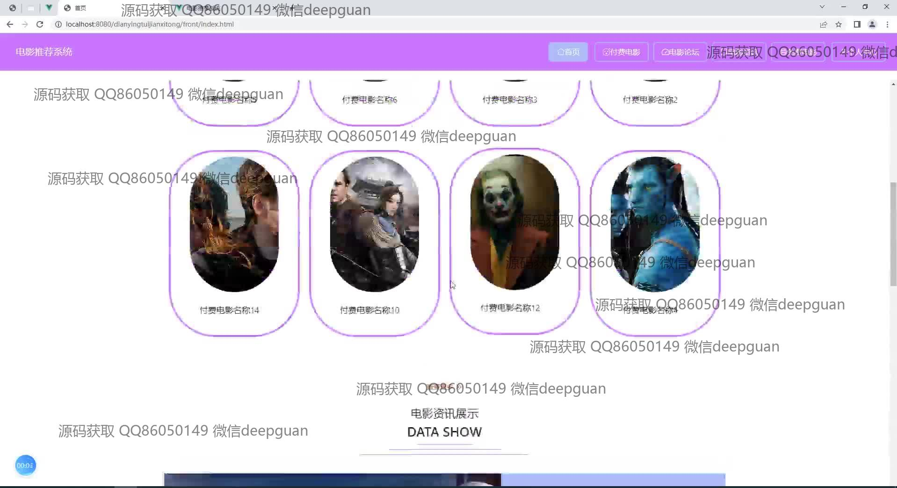
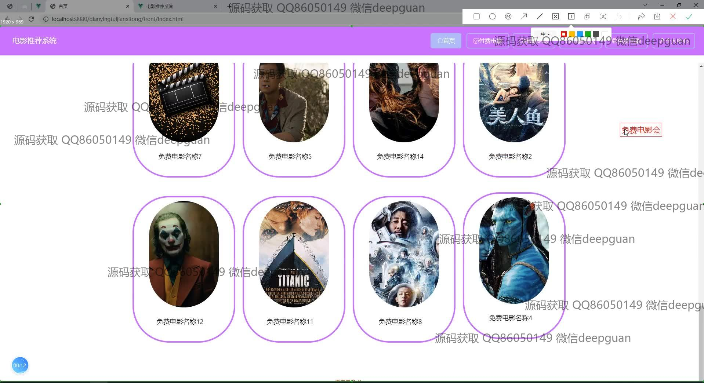
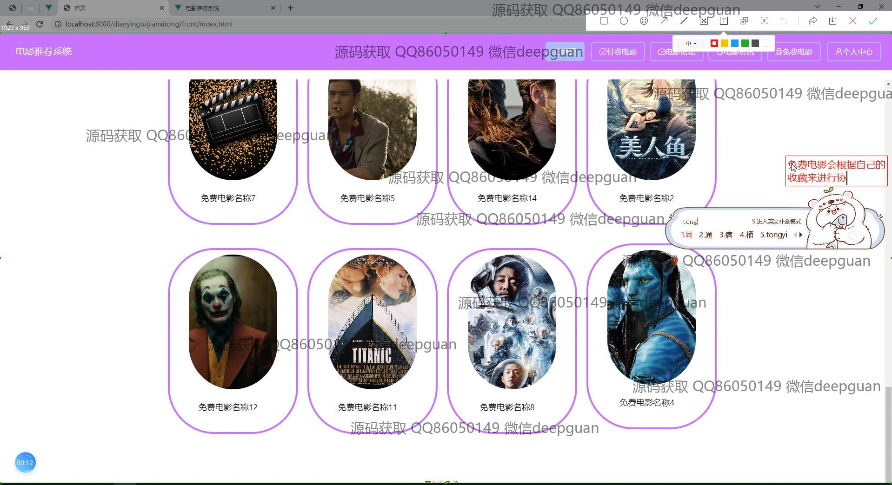
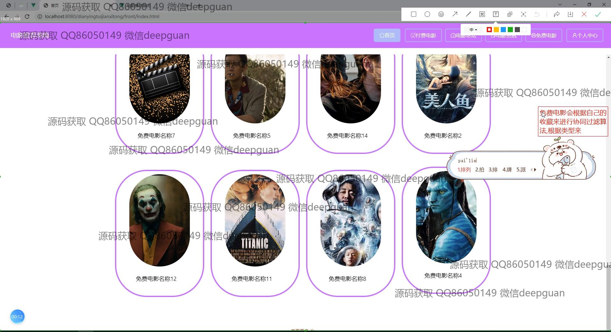
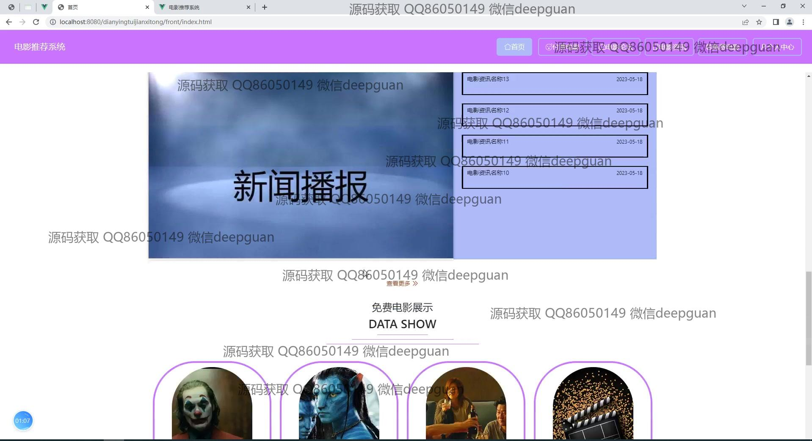

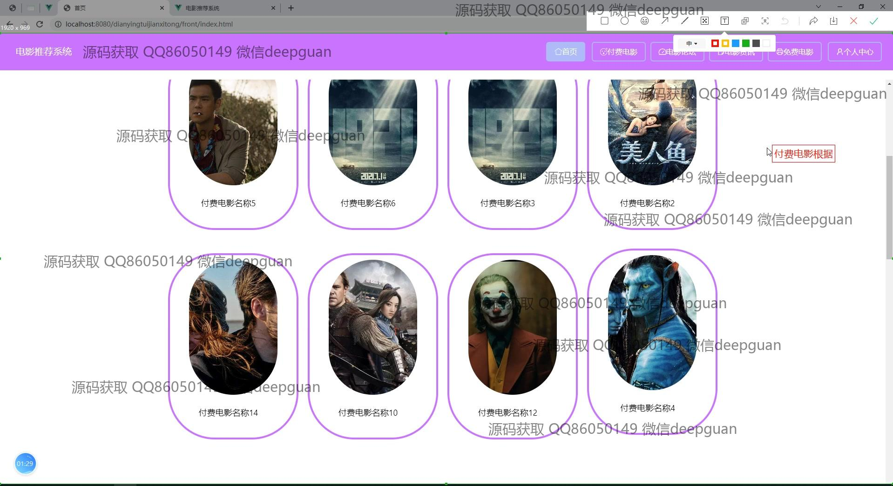
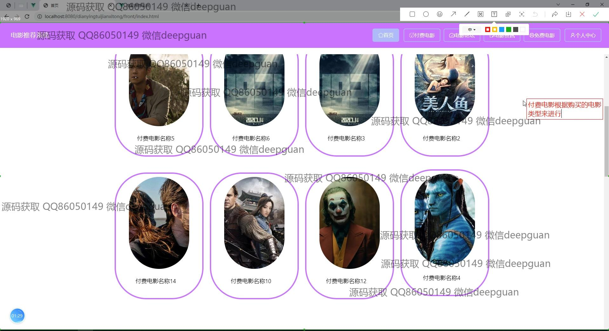
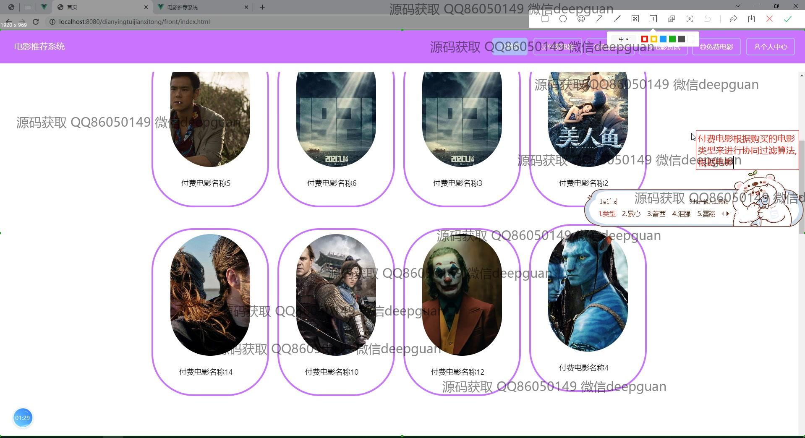

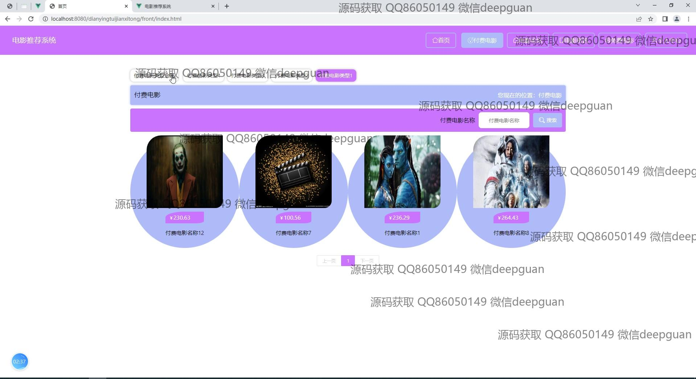
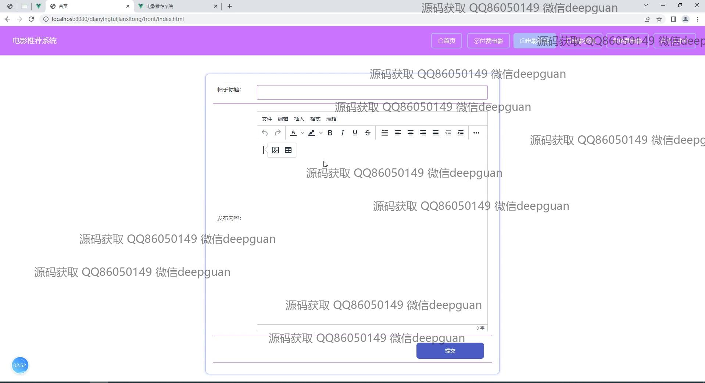
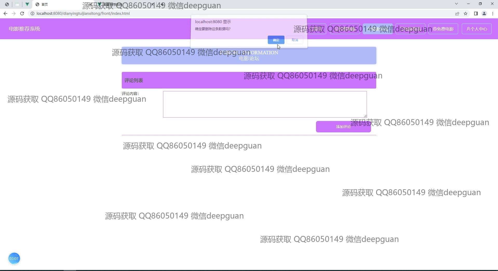
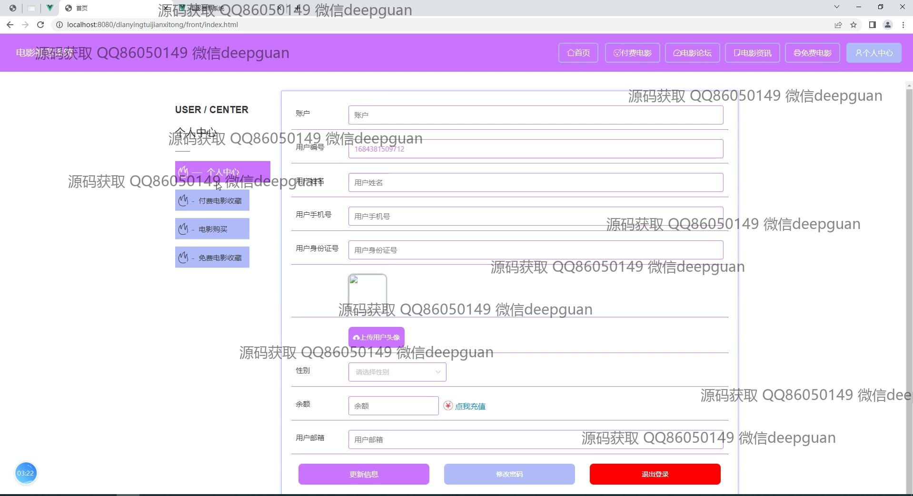
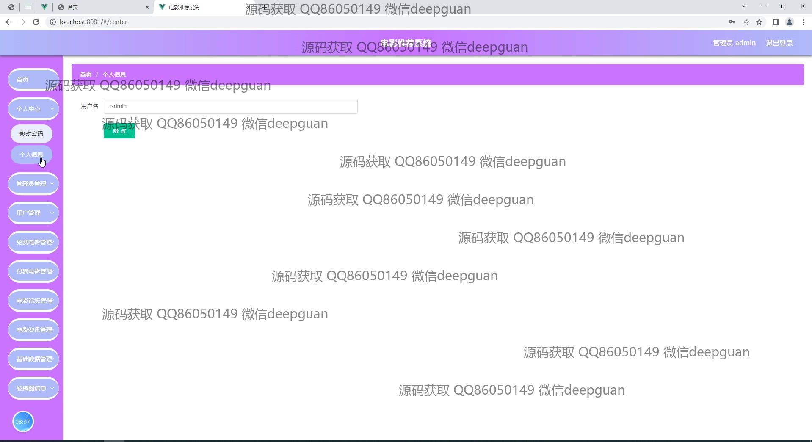
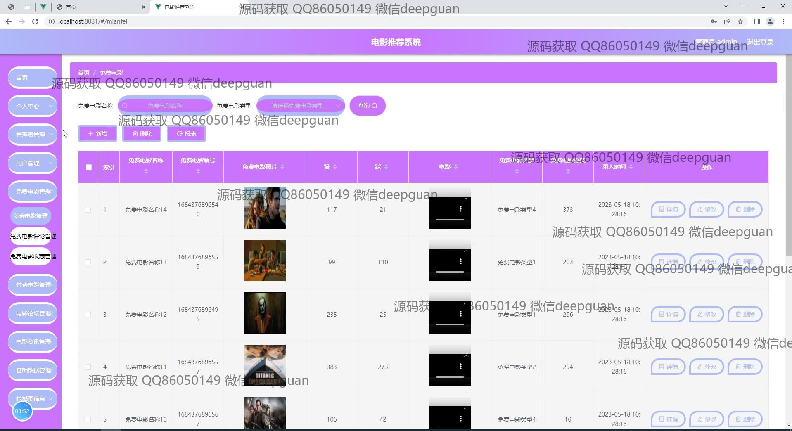
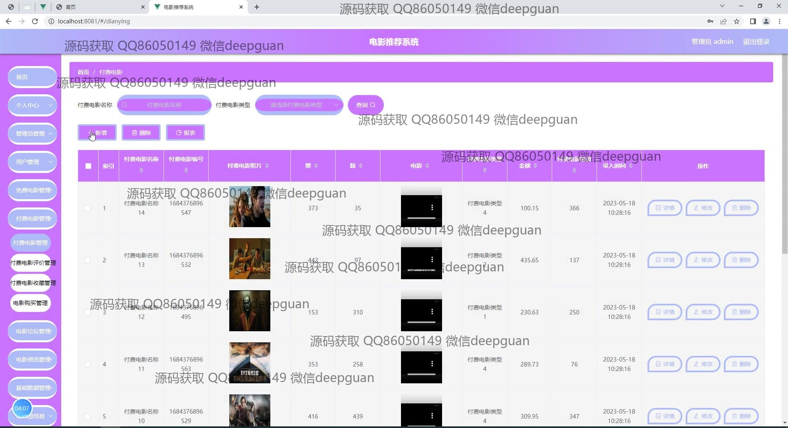
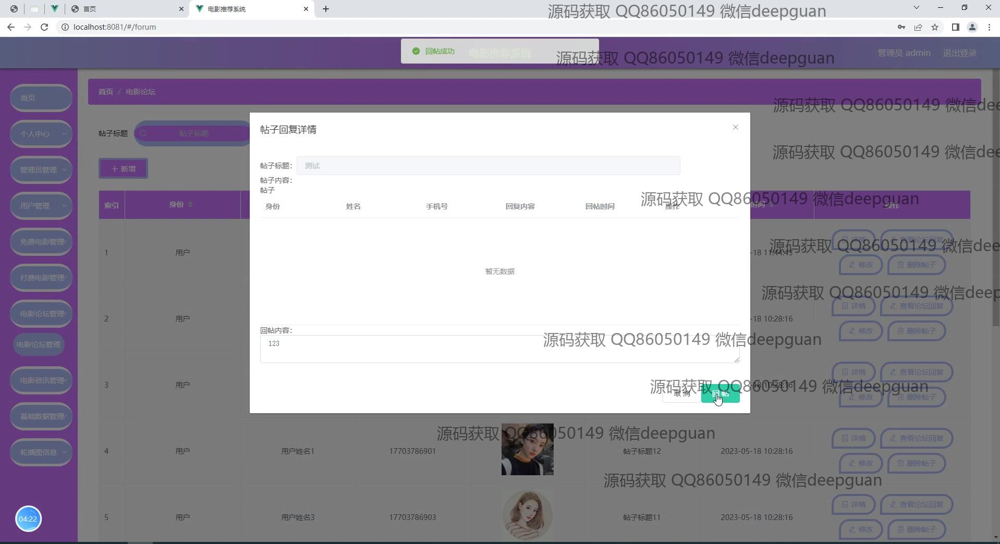
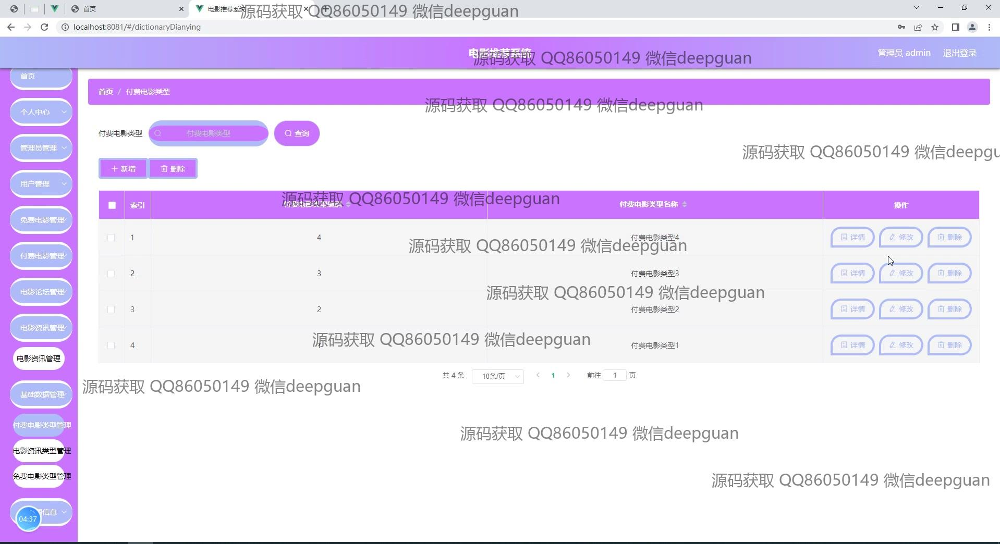
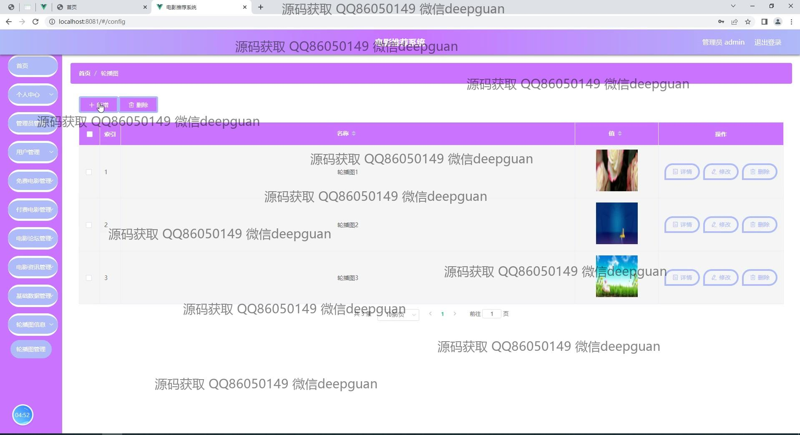

本代码来源于网络,仅供学习参考使用!

